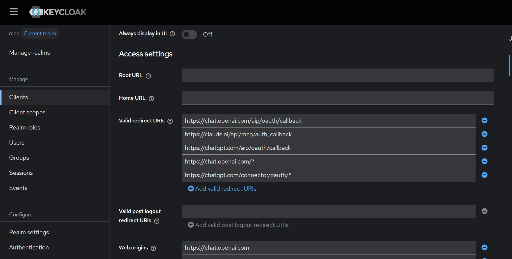
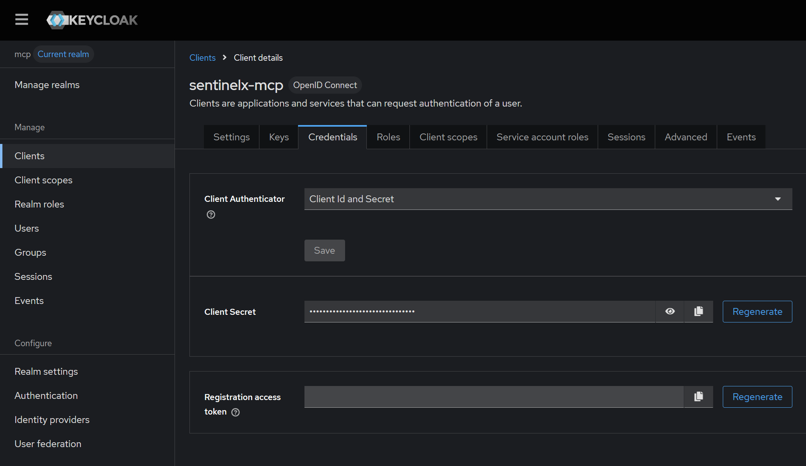
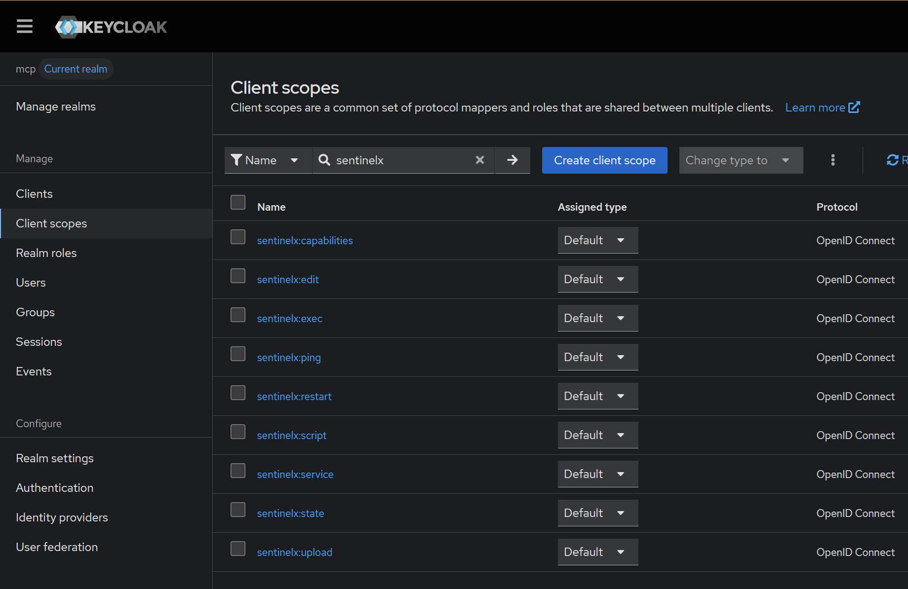
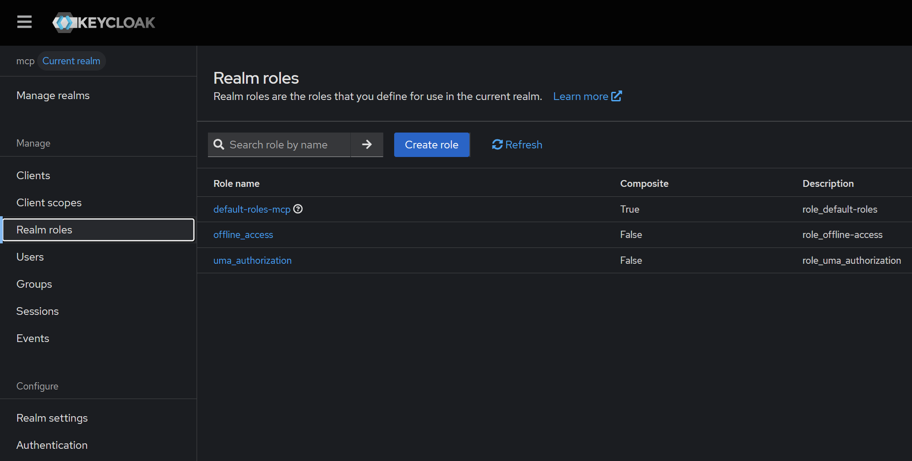

# Keycloak example for SentinelX Core MCP

This document shows one practical way to configure Keycloak as the OIDC provider for `sentinelx-core-mcp`.

Keycloak is a **recommended example**, not a hard requirement. Any compatible OIDC provider should work if it exposes a valid issuer and JWKS endpoint.

## Goal

The goal is to protect the MCP layer with real bearer access tokens while keeping the upstream `sentinelx-core` protected separately by its own internal token.

That gives you two boundaries:

- MCP client -> `sentinelx-core-mcp` using OAuth/OIDC
- `sentinelx-core-mcp` -> `sentinelx-core` using `SENTINELX_TOKEN`

## High-level model

- Keycloak realm: `sentinelx`
- MCP OIDC issuer example: `https://auth.example.com/realms/sentinelx`
- MCP JWKS example: `https://auth.example.com/realms/sentinelx/protocol/openid-connect/certs`
- MCP resource URL example: `https://sentinelx.example.com`

## 1. Create a realm

In Keycloak, create a realm such as:

```text
sentinelx
```

## 2. Create a client for MCP access

Create a client dedicated to the MCP layer.

Suggested ideas:

- client id: `sentinelx-mcp`
- protocol: `openid-connect`
- keep the client purpose narrow

Exactly whether the client is public or confidential depends on your use case and token flow.
For machine-to-machine or controlled backend integrations, confidential clients are often the cleaner option.

## 2.1 Configure access settings and redirect URIs

In the Keycloak client access settings, configure the redirect URIs required by the MCP client you plan to use.
The exact list depends on the client platform. The screenshot below shows an example configuration used during testing.



In the example above, the client includes redirect URIs for MCP-capable clients such as ChatGPT and Claude.
Do **not** blindly copy every redirect URI from the screenshot. Keep only the URIs required by the clients you actually want to support.

Practical notes:

- `Valid redirect URIs` is the most important field for OAuth callback handling
- `Web origins` should also be reviewed for browser-based clients
- wildcard entries should be used carefully
- keep the redirect list as small as possible
- if a client fails the OAuth callback step, verify this screen first

## 2.2 Configure client credentials and authentication method

In the Keycloak client details view, verify that the MCP client is configured with the expected authentication method and that a client secret exists when you plan to use a confidential client flow.
The screenshot below shows an example configuration used during testing.



This screen is especially relevant when you want to authenticate external AI clients or controlled integrations through OAuth/OIDC.
In the example above, the client is configured with `Client Id and Secret`, which is a common setup for confidential client flows.

Practical notes:

- verify the client authenticator matches the flow you intend to use
- if your integration expects a confidential client, confirm that the client secret is present and valid
- rotating the secret will require updating any dependent integration that uses it
- if token acquisition fails, this screen is one of the first places to verify

## 3. Define scopes used by the MCP layer

The MCP server currently expects scopes such as these:

```text
sentinelx:state
sentinelx:exec
sentinelx:restart
sentinelx:service
sentinelx:upload
sentinelx:edit
sentinelx:script
sentinelx:capabilities
```

You should only grant the scopes you actually want the client to use.

### 3.1 Example client scopes in Keycloak

The screenshot below shows an example of client scopes prepared for SentinelX-related operations.



Practical notes:

- keep the scope set minimal
- only grant the scopes required by the MCP tools you intend to expose
- if a protected tool fails with a missing-scope error, verify this screen and the emitted token claims

## 3.2 Roles and role mapping notes

Depending on your Keycloak design, you may also use realm roles or client roles as part of your overall access model.
The screenshot below is useful as a reference when documenting or reviewing role setup.



Practical notes:

- roles and scopes are related but not identical concepts
- use the simplest model that matches your security needs
- if you later add mappers or role-based policies, document clearly how they affect the token claims consumed by the MCP server

## 4. Configure the MCP environment

Edit:

```text
/etc/sentinelx-core-mcp/sentinelx-core-mcp.env
```

Example:

```env
MCP_PORT=8098
MCP_TOKEN=
SENTINELX_URL=http://127.0.0.1:8091
SENTINELX_TOKEN=changeme
OIDC_ISSUER=https://auth.example.com/realms/sentinelx
OIDC_JWKS_URI=https://auth.example.com/realms/sentinelx/protocol/openid-connect/certs
OIDC_EXPECTED_AUDIENCE=sentinelx-mcp
RESOURCE_URL=https://sentinelx.example.com
AUTH_DEBUG=false
LOG_DIR=/var/log/sentinelx-mcp
LOG_FILE=/var/log/sentinelx-mcp/sentinelx-core-mcp.log
```

Restart the service after changes:

```bash
sudo systemctl restart sentinelx-core-mcp
sudo systemctl status sentinelx-core-mcp
```

## 5. Obtain a token

The exact way you obtain a token depends on your Keycloak client type and flow.

For example, with a confidential client and client credentials flow, you typically request a token from Keycloak's token endpoint and then use that bearer token against the MCP endpoint.

## 6. MCP handshake with curl

Initialize a session:

```bash
curl -i -X POST http://127.0.0.1:8098/mcp   -H "Accept: application/json, text/event-stream"   -H "Content-Type: application/json"   -d '{
    "jsonrpc":"2.0",
    "id":"init-1",
    "method":"initialize",
    "params":{
      "protocolVersion":"2025-03-26",
      "capabilities":{},
      "clientInfo":{
        "name":"curl",
        "version":"0.1"
      }
    }
  }'
```

Take the returned `mcp-session-id`, then notify initialized:

```bash
curl -i -X POST http://127.0.0.1:8098/mcp   -H "Accept: application/json, text/event-stream"   -H "Content-Type: application/json"   -H "mcp-session-id: TU_SESSION_ID"   -d '{
    "jsonrpc":"2.0",
    "method":"notifications/initialized"
  }'
```

## 7. Call a protected tool with a real access token

Once you have a real access token from Keycloak, you can call a protected tool such as `sentinel_state`.

```bash
curl -s -X POST http://127.0.0.1:8098/mcp   -H "Accept: application/json, text/event-stream"   -H "Content-Type: application/json"   -H "Authorization: Bearer TU_ACCESS_TOKEN"   -H "mcp-session-id: TU_SESSION_ID"   -d '{
    "jsonrpc":"2.0",
    "id":"call-state-1",
    "method":"tools/call",
    "params":{
      "name":"sentinel_state",
      "arguments":{}
    }
  }' | sed -n 's/^data: //p' | jq
```

If the token is valid and includes the required scope, the call should succeed.
If the scope is missing, the MCP layer should reject the request.

## 8. Troubleshooting

### Token rejected

Check:

- `OIDC_ISSUER` is correct
- `OIDC_JWKS_URI` is correct
- `OIDC_EXPECTED_AUDIENCE` matches what Keycloak emits
- the token includes the expected scope
- the token is not expired

### MCP works for `ping` but protected tools fail

That usually means:

- MCP transport is fine
- session handling is fine
- the problem is auth or scope enforcement

### Protected MCP call works but the upstream action fails

That usually means the problem is no longer OIDC. Instead check:

- `SENTINELX_URL`
- `SENTINELX_TOKEN`
- the upstream `sentinelx-core` status
- allowlists or permissions enforced by the upstream core

## Final recommendation

Use Keycloak as a known-good example if you already run it or want a tested reference.
If you prefer another OIDC provider, keep the same mental model:

- valid issuer
- valid JWKS endpoint
- minimal scopes
- narrow client purpose
- separate upstream SentinelX Core token
